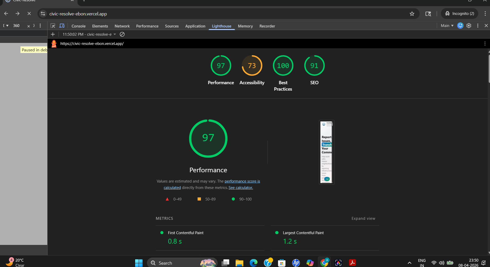

# CivicResolve

CivicResolve is a full-stack civic issue reporting platform built with React, Vite, Express, TypeScript, and MongoDB. Citizens can sign up with email OTP verification, report issues with location and media, and follow issue progress. Department admins can sign in, review issues assigned to their department, update statuses, and manage records from a dashboard.

## Performance Snapshot



## What the Project Includes

### Citizen flow
- Email OTP signup using Brevo transactional email
- JWT-based sign in
- Protected citizen dashboard
- Issue submission with title, type, department, description, location, and optional image/video upload
- Optional AI-assisted issue description from an uploaded image using Gemini
- Citizen profile viewing and editing

### Admin flow
- Department-based admin signup with access code validation
- JWT-based admin sign in
- Protected admin dashboard
- Department-filtered issue listing
- Status updates: `Reported`, `In Progress`, `Resolved`, `Rejected`, `Pending`
- Issue deletion
- Admin profile viewing and editing
- Status history tracking for handled issues

### Platform behavior
- Express REST API with role-aware auth middleware
- MongoDB models for citizens, admins, issues, media, departments, counters, pending signups, and issue status history
- Leaflet/OpenStreetMap based map selection and reverse geocoding in the frontend
- Global loading overlay, route transitions, and a Gemini-powered in-app chatbot

## Tech Stack

### Frontend
- React 19
- TypeScript
- Vite
- Tailwind CSS 4
- React Router
- TanStack Query
- Framer Motion
- Radix UI / shadcn-style components
- Leaflet
- Sonner

### Backend
- Node.js
- Express 5
- TypeScript
- MongoDB + Mongoose
- JWT authentication
- Multer + Cloudinary
- Zod validation
- Brevo transactional email

## Repository Structure

```text
civic_resolve/
|- backend/        # Express + MongoDB API
|- frontend/       # React + Vite client
|- DEPLOYMENT.md   # Deployment notes for Render + Vercel
|- ENV_TEMPLATE.md # Environment variable reference
```

## Main Routes and Screens

### Frontend routes
- `/` landing page
- `/signin` shared citizen/admin sign-in
- `/signup` shared citizen/admin registration
- `/citizen` citizen dashboard
- `/citizen/create-issue` issue reporting form
- `/citizen/profile` citizen profile
- `/admin` admin dashboard
- `/admin/profile` admin profile

### Important API routes

#### Citizen auth and profile
- `POST /api/v1/citizen/signup/request-otp`
- `POST /api/v1/citizen/signup/verify-otp`
- `POST /api/v1/citizen/signin`
- `GET /api/v1/citizen/profile`
- `PUT /api/v1/citizen/:id`
- `GET /api/v1/citizen/issues`

#### Admin auth and profile
- `POST /api/v1/admin/signup`
- `POST /api/v1/admin/signin`
- `GET /api/v1/admin/profile/:id`
- `PUT /api/v1/admin/:id`
- `GET /api/v1/admin/issues`
- `GET /api/v1/admin/handled-issues`
- `PUT /api/v1/admin/issue/:id/status`

#### Issues
- `POST /api/v1/citizen/create-issue`
- `GET /api/v1/all-issues`
- `GET /api/v1/departments`
- `DELETE /api/v1/issue/admin/:issueid`

## Current Domain Model

- `Citizen`: citizen account details
- `Admin`: admin account linked to a department and access code
- `Department`: allowed departments and their access codes
- `Issue`: reported civic issue with human-readable `customIssueId`
- `Multimedia`: uploaded issue media stored in Cloudinary
- `PendingCitizenSignup`: OTP-gated signup staging record
- `IssueStatusHistory`: audit trail for admin status changes
- `Counter`: sequence generator used for custom issue IDs

## Local Setup

### 1. Clone and install dependencies

```bash
git clone <your-repo-url>
cd civic_resolve
cd backend && npm install
cd ../frontend && npm install
```

### 2. Create environment files

Create `backend/.env` and `frontend/.env` from the examples in `ENV_TEMPLATE.md`.

### 3. Required backend environment variables

```env
DATABASE_URL=
JWT_PASSWORD=
CLOUDINARY_CLOUD_NAME=
CLOUDINARY_API_KEY=
CLOUDINARY_API_SECRET=
PORT=3000
BREVO_API_KEY=
BREVO_SENDER_EMAIL=
BREVO_SENDER_NAME=CivicResolve
CITIZEN_SIGNUP_OTP_EXPIRY_MINUTES=10
```

### 4. Required frontend environment variables

```env
VITE_API_BASE_URL=http://localhost:3000
VITE_GEMINI_API_KEY=
```

`VITE_GEMINI_API_KEY` is optional. Without it, the chatbot and AI description helper will not work.

### 5. Start the app

Backend:

```bash
cd backend
npm run dev
```

Frontend:

```bash
cd frontend
npm run dev
```

## Running in Development

- Backend default port: `3000` unless overridden by `PORT`
- Frontend default Vite port: usually `5173`
- Backend base URL in local development should match `VITE_API_BASE_URL`
- The frontend also contains a Vite proxy entry for `/api`, but most app calls currently use `VITE_API_BASE_URL` directly

## How Issue Reporting Works

1. A citizen signs up by requesting an email OTP.
2. After OTP verification, the citizen can sign in and access protected routes.
3. The citizen reports an issue with department, issue type, description, map-selected location, and optional media.
4. Media uploads are stored in Cloudinary through Multer.
5. The backend generates a custom issue ID like `RP-YYMMDD-HHMMSS-NNNN`.
6. A confirmation email is sent after successful issue creation.
7. Admins only see issues for their department and can update the issue lifecycle from the dashboard.
8. Each admin status change is recorded in `IssueStatusHistory`.

## Notes for Anyone Contributing

- The backend is written in TypeScript and compiled to `backend/dist`
- Auth is token-based and stored in `localStorage` on the frontend
- Department names are currently hardcoded to `MCD`, `PWD`, `Traffic`, `Water Supply`, and `Electricity`
- Citizen signup is OTP-first; admin signup is access-code-first
- Guest/demo login values are hardcoded in the sign-in page, so they only work if matching seeded accounts exist in the database

## Deployment

Deployment instructions live in `DEPLOYMENT.md`.

The existing deployment docs target:
- Backend on Render
- Frontend on Vercel
- MongoDB Atlas for database hosting
- Cloudinary for media storage

## Security Reminder

Do not commit real `.env` values, API keys, SMTP/Brevo credentials, JWT secrets, or database URIs. If any real secrets were exposed during development, rotate them before deploying or sharing the project.
